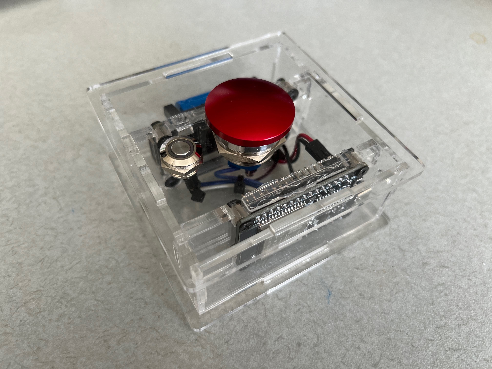

# Emergency Question Mark Button (EQMB)

For a certain professor that uses a lot of question marks when reviewing/commenting our manuscripts.
Some question marks are subject to lurk in the maintext because the said professor refuses to use the Word's "comment" feature. Those lurking question marks are unprecedented gifts to any editor whom they *may not* concern.

This project has an alt-name: the <b>EMERGENCY BUTTON for a certain PROFESSOR'S RAGE</b>, or <b>EBPR</b>.

## Features

This is an application based on ESP32 microcontroller. It comes with a top Rage-Button, a BT control button, a micro-USB charging port and a power switch.

### Power

This device is powered by a single 16340 lithium battery that can be recharged from micro-USB. There is a power switch on the bottom side of the device.

### Rage-Button

When pressed, the top button sends a <kbd>?</kbd> character to the host computer. Follow-up presses within 750ms of the preceding one will send more <kbd>?</kbd>s, up to 6 in a single press. This feature is called "rage streak".

### Bluetooth (BT) Control Button

When the BT control button is pushed, the device will enter BT pairing mode (with blue LED flashing) for accepting new device pairings. A second push will exit the pairing mode.

Releasing the BT control button after holding it for over 5sec will trigger a hard reset of the device, deleting all paired devices.

### Sleep Mode

The device will enter sleep mode when left idle for over 2min. Push the BT control button can wake it up.
